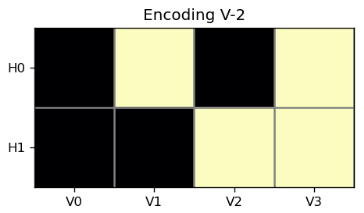

# Learning in Boltzmann Machines

This repository accompanies a presentation on Boltzmann Machines, focusing on the 4-2-4 encoder task, symmetry analysis, and investigations into hidden units and robustness. Below is a detailed overview of the project, including key findings and visualizations.

---

## Authors  
**Leonardo & Mark**
Based on the foundational work by *David H. Ackley, Geoffrey E. Hinton, and Terrence J. Sejnowski*.

---

## Repository Structure  
- `/plots&graphics`: Contains all figures
- `/Slides`: Original presentation slides.

---

## Part I: The Model  

### The Boltzmann Machine  
The Boltzmann Machine (BM) is an energy-based stochastic model with recurrent connections and hidden units. Its primary goal is to learn input distributions to generate new data resembling the training set. Training involves minimizing the divergence between the data distribution and the model distribution using a two-phase process: the **Wake phase** (driven by real data) and the **Sleep phase** (driven by "dream" data). This leads to Hebbian-like weight update rules, as shown in the equation:

 

### The Encoder Task  
The 4-2-4 encoder task involves two visible layers (*V1* and *V2*) connected via a hidden layer (*H*), with the goal of ensuring \( V1 = V2 \). The architecture enforces sparse activation, where only one neuron is active per region. This setup mimics efficient communication between brain regions through binary encoding. The structure is visualized in the schematic below (`Figure 1`), highlighting recurrent connections within visible layers and symmetric encodings to the hidden layer.

<figure>
  
  <figcaption>Figure 1: Wake-sleep training phases</figcaption>
</figure>

---

## Part II: Reproduction  

### Reproducing the 4-2-4 Encoder  
The implementation of the 4-2-4 encoder uses recursive connectivity plots (`Figure 2`), where each neuron’s connections mirror the network’s overall structure. Weight matrices (visualized in (`Figure 3`) reveal mirror symmetry between *V1* and *V2*, ensuring consistent activation of hidden units.

  

<em>Figure 2: Recursive Connectivities inside the 4-2-4 model</em>

 

  

<em>Figure 3: Model of the connections</em>

Binary encodings are analyzed using Hamming distances, as shown in `Figure 4`. Four distinct encodings emerge: `(11)`, `(10)`, `(01)`, and `(00)` (`Figure 5`). While the theoretical minimum Hamming distance is 1, empirical results (from 50 samples) show imperfect separation due to the stochastic nature of BMs and limited training epochs.

<figure>
  
  <figcaption>Figure 4: Encoding distances</figcaption>
</figure>

<figure>
  
  <figcaption>Figure 5: Four different encodings</figcaption>
</figure>

### Symmetry in Communication  
Symmetry between *V1* and *V2* is quantified using cosine similarity over training epochs (`Figure 6 & 7`). Recurrent connections within visible layers and symmetric encodings to the hidden layer ensure robust communication. This symmetry is critical for stabilizing the network during inference.

<figure>
  
  <figcaption>Figure 6: Symmetry behavior over training epochs</figcaption>
</figure>

<figure>
  
  <figcaption>Figure 7: Symmetry Connections</figcaption>
</figure>

---

## Part III: Investigations  

### Impact of Hidden Units  
Increasing the number of hidden units improves code separation, as shown in `Figure 8`. With 10 hidden units, the minimum Hamming distance approaches the theoretical limit (95% confidence intervals). However, excessive hidden units may lead to overfitting, highlighting the trade-off between separation and generalization.

<figure>
  
  <figcaption>Figure 8: Different numbers of hidden units</figcaption>
</figure>

### Robustness of Encodings  
The network fails with `(+1, -1)` neuron states (common in Hopfield networks) due to interference in the hidden layer. Experiments removing recurrent connections (`Figure 9`) surprisingly show preserved or improved encodings, suggesting hidden units can compensate for missing recurrent links.

<figure>
  
  <figcaption>Figure 9: Remove recurrent connections</figcaption>
</figure>

---

## Implementation Notes  
- **Neuron States**: Use `(1, 0)` instead of `(+1, -1)` to avoid interference.
- **Training**: Noise is added to input data to prevent weight explosion.
- **Weight Updates**: Discrete updates are applied instead of gradient descent.
- **Equilibrium**: An annealing scheme ensures the network reaches thermal equilibrium during sampling.

---

## Conclusions & Outlook  
### Key Findings  
- Hidden units are essential for robust encodings and compensating for architectural changes (e.g., removed recurrent connections).
- Practical adjustments—such as noise injection and annealing—are critical for stable training.

### Future Directions  
- **Complex Datasets**: Explore BMs on datasets with richer correlations (e.g., natural images).
- **Information Theory**: Quantify hidden layer efficiency using mutual information or partial information decomposition.

---

## References  
- Ackley, D. H., Hinton, G. E., & Sejnowski, T. J. (1985). *A learning algorithm for Boltzmann machines*.
- Hinton, G. E. (1986). *Learning efficient communication in Boltzmann machines*.

